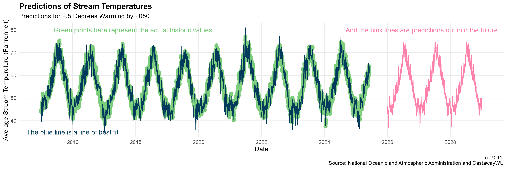

## The one-liner

> We integrated data from the National Oceanic and Atmospheric Administration, the City of Salem, and CastawayWu into three datasets about weather, stream temperatures, and tree canopies so that the City of Salem can utilize predictions to identify streams at risk of temperature increases.

**Role:** Data Modeler, Data Analyst
**Team:** Brooke Proctor, Siera Edwards, and Serenna Walter
**Repo:** [https://github.com/Serenna4/Emerald-Ash-Borer-Capstone-Project](https://github.com/Serenna4/Emerald-Ash-Borer-Capstone-Project)

## The question

What problem were you solving, and why does it matter to a real stakeholder?
Two or three sentences. No jargon a hiring manager would have to look up.

Working with the City of Salem to address their concerns regarding rising stream temperatures, we created an iterative series of models to predict stream temperature using a variety of variables. This topic is important because we know that rising temperatures lead to lower dissolved oxygen and increased algal blooms which can impact the local community and their ecosystems. Dissolved oxygen is essential for fish and other aquatic life to continue living, and algal blooms can be toxic to humans and animals. By predicting stream temperatures, the City of Salem can identify streams that are at risk of temperature increases and take action to protect their ecosystems.

## The data

Stream Temperature Data: This dataset was sent to us as a comma-delimited file (CSV) with 7543 rows and 5 columns, and had a file size of 426 KB. It was sourced from the CastawayWU Mill Creek Research Project. This dataset contains daily average temperatures, dissolved oxygen readings, and turbidity for two sites along the Mill Creek. The two data collection sites were MIC3, in downtown Salem, and MIC12, located southwest of downtown Salem

The second piece of data that we brought into our project was climate data for Salem from NOAA. This dataset gave us daily information about the location of data collection, the average wind speed, precipitation, if it snowed, snow depth, highest temperature, lowest temperature, and average temperature. This dataset was downloaded as a CSV file with 48,603 rows and 18 columns, and had a file size of 15.1 MB. 

The third data source used in this project contained information on public storm creeks and rivers in Salem, authored by the City of Salem. This dataset contained the locations of all bodies of water in Salem, including the two data collection sites along the Mill Creek from the stream temperature data. This data was downloaded as a shapefile with 2,672 rows and 24 columns, and had a file size of 619 KB. This data can be downloaded from DATASALEM.

The final data source used in the research was tree canopy information from the Tree Plotter Canopy website managed by the City of Salem. This data contained polygons for different levels of tree canopy area across the Salem area. This data was downloaded as a shapefile with 3,649 rows and 18 columns, and had a file size of 3,184 KB.

The most difficult part of engineering the data was creating shapefile joins to get the latitiude and longitude of relevant tree canopy coverage across Salem. This was done using ArcGIS Pro's Buffer tool. In addition, some cleaning was done to trim different data sources to include only information relevant to the project. 

## The approach

Linear regression models with coefficient interactions were created iteratively in R, with different data included for each model. The first set of ourliers were removed, because they were a result of an unprecendented heatwave in Salem. After this, different models were created using different combinations of features and interactions. The final model was selected due to it's high R-squared value and low RMSE. This model can be used to predict stream temperatures, and can be used by the City of Salem to identify streams that are at risk of temperature increases.

## Findings

Our best model has an R-squared value of .9442, meaning that 94% of the variance in stream temperature can be explained by our model. This model also produced a low RMSE of 2.106. 

The pictured plot does not show our best model, but the second best, to allow for predictions to be shown.

{fig-alt="Placeholder capstone figure" width="90%"}

With the line of best fit (blue) overlaid on the actual historic values for stream temperatures (green), we can see how closely tied they are. This is a visual demonstration of the R-squared value. This graph displays the predictions (pink) into the future for stream temperature, given all values are identical to 2024 aside from the weather temperature, which is steadily increasing at a slope of 2.5 degrees Celsius of warming by 2050. While this pseudo-future data is not highly accurate, the predictions follow the expected sinusoidal pattern.

## The full write-up

### Published Google Doc

[Read the full write-up here](https://docs.google.com/document/d/1-5b2VmHpuZg3rgVxR8TKl9OGzZodKJg7zdW4fq_Lx4g/edit?usp=sharing){.btn .btn-primary}

## Dig deeper

- 📦 **Code & pipeline:** [Emerald-Ash-Borer-Capstone-Project](https://github.com/Serenna4/Emerald-Ash-Borer-Capstone-Project)
- 📊 **Poster:** [Poster Presentation](https://docs.google.com/presentation/d/1yrokVDuboehmXGB3SbasJauDw1_vijpIWRHjAQHDP-w/edit?usp=sharing)
